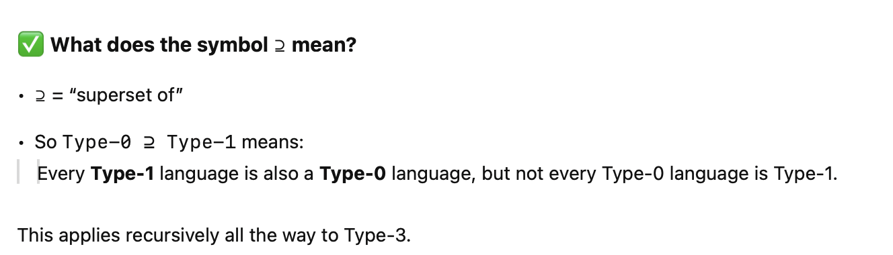

# Lecture: Regular Expressions – Theory

## ✅ Summary

This lecture introduces the **theoretical foundations of regular expressions (regex)** — a powerful way to match patterns in text. It emphasizes their role in both **formal language theory** and **practical data cleaning**, especially when validating or transforming data formats like dates and numbers.

Key points include:
- The **origin of regex** from formal language theory.
- How regex is defined using basic building blocks (e.g., alternation, concatenation, Kleene star).
- Their place in the **Chomsky hierarchy** as Type-3 languages.
- A comparison of **regular grammars** (theoretical) and **regex syntax** (practical).
- An example of how floating-point numbers can be matched using both approaches — with regex being far more concise and usable.

---

## 📚 Details

### 🔸 Why Study Regular Expressions?

- Regex is **used everywhere** in practice:
  - Text editors (`find/replace`)
  - Programming and scripting (Python, Perl, Bash, R, Java)
  - **Screen scraping**, parsing, and automated data extraction

- Think of regex as:
  > "🧪 Wildcards on steroids" — more powerful and flexible than `*.csv` style patterns

---

### 🔸 Why Regex for Data Cleaning?

Regex helps:
- **Match patterns** (e.g., dates, phone numbers, emails)
- **Assess and transform** data into standardized formats
- Used in:
  - **OpenRefine's GREL language**
  - Data-cleaning scripts
  - Workflow automation tools

**Example — Date Formats**:
- Standard: `YYYY-MM-DD` (ISO 8601)
- U.S.: `MM/DD/YY`
- European: `DD.MM.YYYY`

Regex can detect these formats and help convert them into a consistent form.

---

### 🔸 What is a Regular Expression (Theoretically)?

In formal language theory:
> A regular expression is a **formal notation that defines a search pattern**, used to recognize strings over an alphabet.

#### 🔹 Base Elements:
- `∅` – empty set  
- `ε` – empty string  
- `Σ` – an alphabet (e.g., all digits or letters)

#### 🔹 Operators (building blocks):
| Symbol   | Meaning                               |
|----------|----------------------------------------|
| `R | S`  | Alternation (R or S)                  |
| `RS`     | Concatenation (R followed by S)       |
| `R*`     | Kleene star: zero or more of R        |
| `(R)`    | Parentheses for grouping and precedence |

These components define **inductive/recursive** structures for pattern building.

---

### 🔸 Chomsky Hierarchy and Regular Languages

Regex patterns belong to **Type-3** languages — the simplest and most restricted in the **Chomsky hierarchy**:

Type-0 ⊇ Type-1 ⊇ Type-2 ⊇ Type-3 (Regular Languages)


|Type |Name|Language Class|Machine Needed|
|-----|-----|-----|-----|
|Type-0|Recursively enumerable|Most expressive (includes all computable problems)|Turing Machine|
|Type-1|Context-sensitive|Can use context to decide grammar rules|Linear Bounded Automaton|
|Type-2|Context-free|Useful for programming languages|Pushdown Automaton|
|Type-3|Regular (⊆ all others)|Most restricted; simple patterns like regex|Finite Automaton|




📌 Regex **cannot** recognize complex constructs like:
- Palindromes
- Primality
- Balanced parentheses  
These require **context-free** or higher-level languages.

---

### 🔸 Example: Floating-Point Numbers

#### Using a Regular Grammar:
- Very verbose and hard to manage
- Involves production rules, non-terminal symbols, recursive expansions

#### Using a Regular Expression:
```regex
[-+]?[0-9]*\.?[0-9]+([eE][-+]?[0-9]+)?

Explanation:
	•	[-+]? → optional sign
	•	[0-9]* → optional digits before the decimal
	•	\.? → optional period
	•	[0-9]+ → at least one digit
	•	([eE][-+]?[0-9]+)? → optional scientific notation (e.g., e+10)

⚡ Key Insight:

Regular expressions are more practical and concise than grammars when validating data patterns.

⸻

🧠 Closing Thought

Regular expressions have deep theoretical roots but are also incredibly useful in real-world data cleaning. They allow us to:
	•	Define patterns
	•	Validate correctness
	•	Transform formats efficiently

In the next session, we’ll shift to the practical usage of regex: how to actually write and apply these expressions in cleaning tasks.