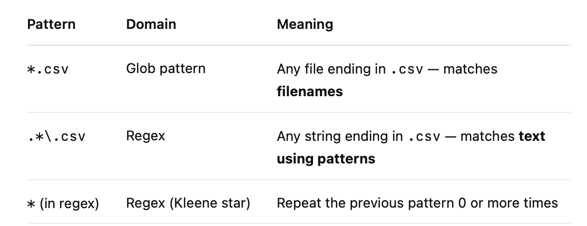

# inductive vs. Recursive

> * Inductive definition means: start from basic cases and define how to build more complex things.
> •	Recursive definition means: a regular expression can be defined in terms of other (simpler) regular expressions.

## Q&A: If I setup a project to move data from A -> B and then add A -> B -> C, would this process be called inductive or recursive?

## Recursive

----
# Regex vs. GLOB
So if you had a regex like **".*\\.csv"**:
. means “any character”
.* means “any sequence of characters” — similar to glob *
\.csv matches the literal .csv extension

So in regex, .*\.csv is functionally similar to *.csv in glob — but the logic is different.

