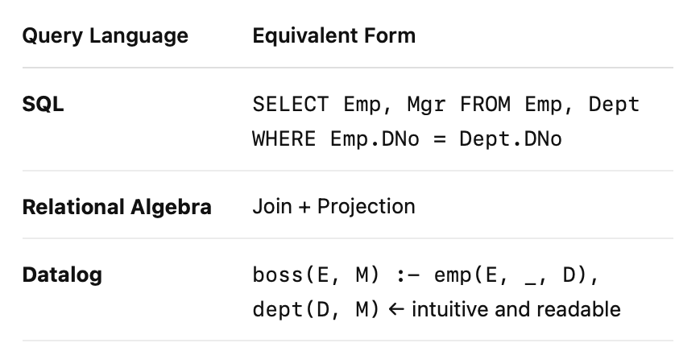

# Lecture: Relational Data – From Syntax to Semantics

## ✅ Summary

This lecture marks the transition from **syntactic data cleaning** (regex, OpenRefine) to **schema-level and semantic-level validation** using the **relational model** and database technologies. 

After cleaning individual columns, the next step is ensuring that **relationships between columns and across tables** are logically sound using **relational queries** and **integrity constraints (ICs)**.

Key ideas covered include:
- Understanding the **relational model**, schemas, and instances
- Introducing **relational query languages**: Datalog, SQL, Relational Algebra, and Calculus
- Using **queries and constraints** to detect deeper logical data errors
- Demonstrating how multiple query languages share a logical core

---

## 📚 Details

### 🔸 Motivation: From Patterns to Logic

- Tools like **regex** and **OpenRefine** help fix:
  - Typos
  - Inconsistent formats
  - Pattern mismatches

- However, they **do not address logical errors** such as:
  - Violated foreign key relationships
  - Contradictions (e.g., age and date of birth mismatch)
  - Duplicates across rows or tables

🧠 Example: Even after OpenRefine cleaning, two different rows may have the same `ID` or mismatched `ZIP` between `PERSON` and `ADDRESS` tables.

---

### 🔸 Schema-Level and Semantic Errors

Examples of schema violations:
- Invalid values (typos, wrong domain)
- **Uniqueness violations** (duplicate IDs)
- **Foreign key mismatches** (e.g., `PERSON.ZIP` not found in `ADDRESS.ZIP`)
- Incomplete or conflicting information across fields or tables

---

### 🔸 Workflow Overview

Raw Data
   ↓
Syntactic Cleaning (OpenRefine)
   ↓
Load into Database
   ↓
Schema/Logical Checks (Queries & Constraints)

Once data is inside a Relational DB, tools like Datalog or SQL can be used to enforce logical integrity.

⸻

# 🔸 What is the Relational Model?
	•	Tables = Relations
	•	Rows = Tuples
	•	Columns = Attributes
	•	Schema = Header / structure of the table
	•	Instance = Actual content in the table
	•	RDBMS = Relational Database Management System (e.g., MySQL, PostgreSQL)

📌 Developed by Edgar F. Codd in the 1970s, still the foundation of modern structured databases.

⸻

# 🔸 Related Concepts
	•	Closely tied to Predicate Logic
	•	Inspired conceptual modeling in Entity-Relationship (ER) models
	•	Can represent:
	•	Object-oriented, graph, XML, and other data formats

⸻

# 🔸 Languages for Querying Relational Data

| Language|Role|
| --- | --- |
|First-order logic / Relational Calculus (RC)|Theoretical foundation|
|Datalog | Logic-based rule language (focus of course) |
|Relational Algebra (RA) |
Underlying DB engine uses this for execution plans |
| SQL | Industry-standard query language | 

> While SQL is dominant, it often hides the logical structure. Datalog exposes it clearly.

🔸 Datalog vs. SQL vs. Algebra

All can express similar queries.

Example: Find employee-manager pairs based on matching department number.

🧠 Datalog rule has:
	•	Head: what we want to compute (e.g., boss(E, M))
	•	Body: conditions from base tables (emp and dept)

⸻

🔸 Why Learn Datalog First?
	•	Reveals the logical structure of queries and constraints
	•	Great for expressing integrity constraints
	•	Easier to debug and reason about than SQL
	•	Builds foundation to understand what SQL is doing underneath

⸻

🔸 Summary Slide Takeaways
| Category |Tools/Concepts |
|----|---|
|Syntax|Regular expressions, OpenRefine|
| Schema/Semantics| Datalog, SQL, integrity constraints|
Synthesis| Workflow modeling, provenance tracking (e.g., YesWorkflow)|

🧠 Think of this as going from “is the data formatted right?” → “does the data make sense?”

In the next lecture, you’ll dive deeper into Datalog and how to use it to check relational integrity constraints.