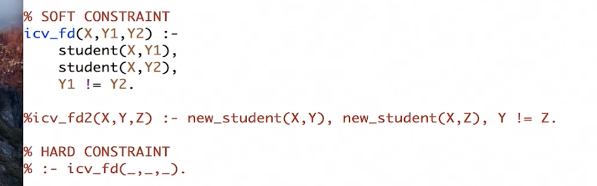
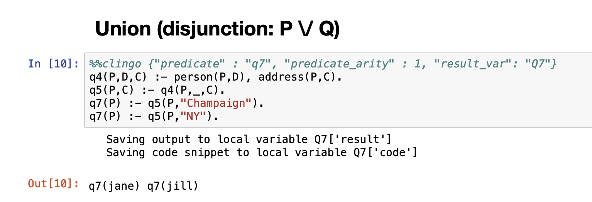

icv => Integrity constraint violation

**soft** constraint - show the issue or violated pair

**hard** constriant - doesnt return the violated pair(but ignores, usually used when there is lot to process) - actually abort.

* for class, we are not using goign to abort(hard).

Header:
we dont need to write it down explicityly y1 < y2 because it got there only when Y1 and y2 are different.

# Week 5 Lab demo
Note this for union

