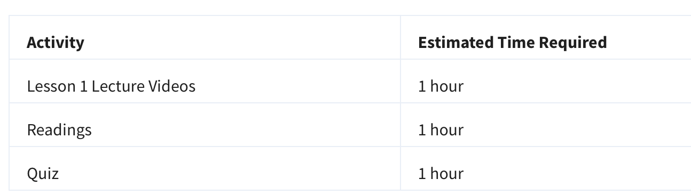

# Week 9: YesWorkflow

## Overview

In this week we will bring together workflow models (for script-based workflows, for example, in Python or R) and provenance using an emerging open source tool called YesWorkflow. While we have previously looked at YesWorkflow, in this week we will focus on some specific demonstrations of that tool that showcase how hybrid provenance queries can be used to better reveal and query provenance information from script-based workflows.

## Weekly Readings

[MB15] McPhillips, T., Bowers, S., Belhajjame, K. & Ludäscher, B. (2015). 
[Retrospective provenance without a runtime provenance recorder](https://www.usenix.org/system/files/tapp15-mcphillips.pdf)
. in Proceedings of the 7th USENIX Conference on Theory and Practice of Provenance.
[PF19] Pimentel, J. F., Freire, J., Murta, L. & Braganholo, V. A. (2019). 
[Survey on Collecting, Managing, and Analyzing Provenance from Scripts](https://proxy2.library.illinois.edu/login?url=https://dx.doi.org/10.1145/3311955)
. ACM Comput. Surv. 52, 47:1-47:38. Time

This module should take approximately 3 hours of dedicated time to complete, with its videos and associated readings.

# Lessons

The lessons for this module are listed below:

# Goals and Objectives

Upon successful completion of this module, you will be able to:

- Understand how different forms of provenance can be combined to answer advanced provenance queries.
- Explore YesWorkflow provenance artifacts and related YesWorkflow demonstrations.
- Document your own script-based or manual data cleaning workflows using YesWorkflow annotations.

# Key Phrases/Concepts
Keep your eyes open for the following key terms or phrases as you interact with the lectures and complete the activities.

- Prospective, retrospective, and hybrid forms of provenance

# Guiding Questions
Develop your answers to the following guiding questions while watching lectures and working on assignments throughout the module.

- What are the benefits of workflow systems and how can authors of conventional (and highly popular) script-based approaches experience similar benefits?
- What kinds of provenance information can be extracted from a script? At (or before!) design time? During and after runtime?
- How can workflow and provenance queries help with assessing the quality of data and the processes that created the data?
