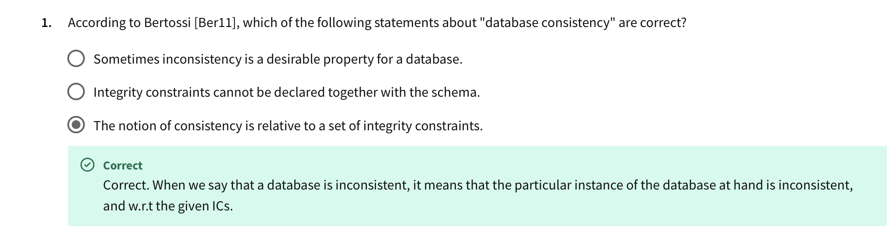

“The notion of consistency is relative to a set of integrity constraints.”

Bertossi explicitly states:
“As we can see, the notion of consistency is relative to a set of integrity constraints. When we say that a database is inconsistent, it means that the particular instance of the database at hand is inconsistent, and wrt the given ICs.”

# 2
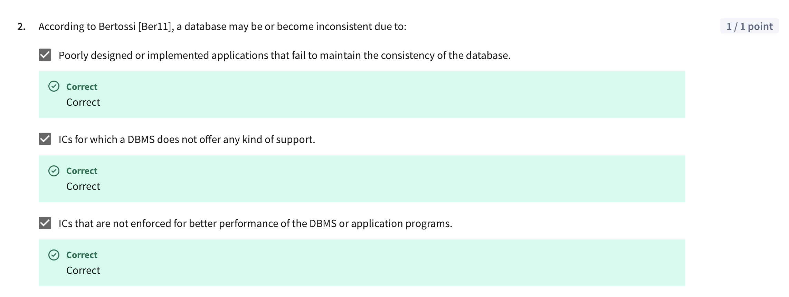
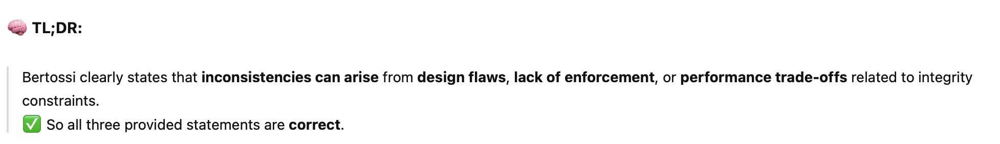

# 3
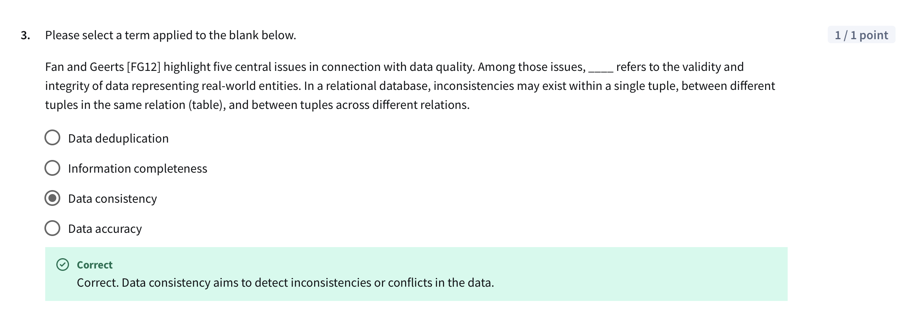

# 4
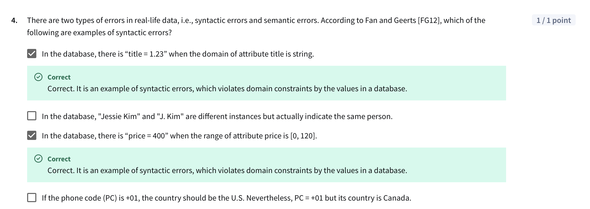
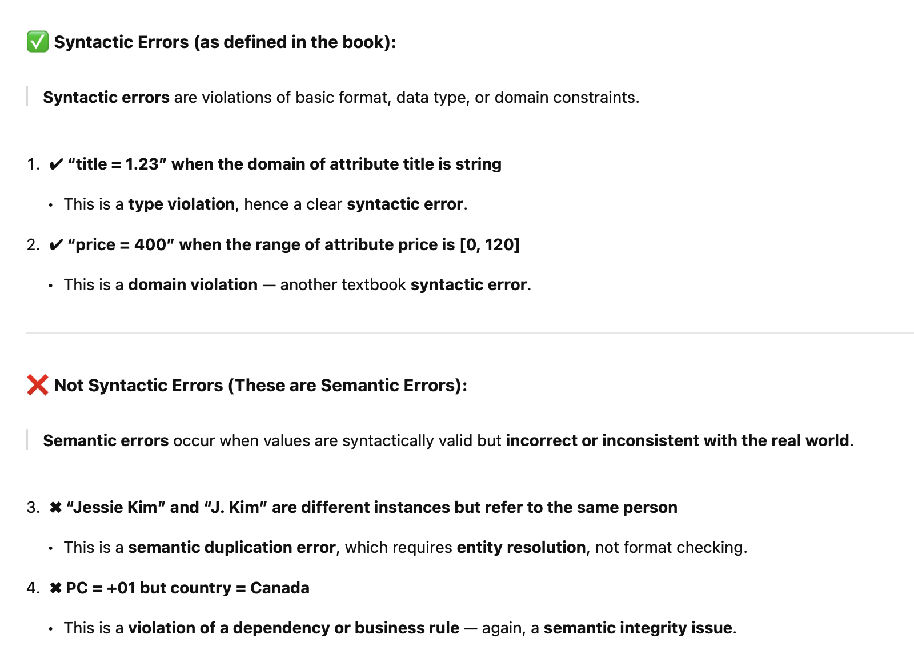

# 5
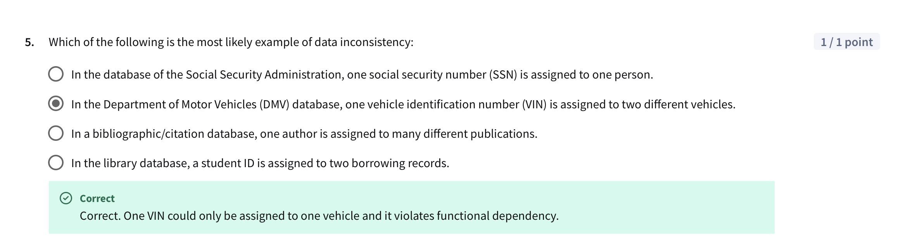

# 6
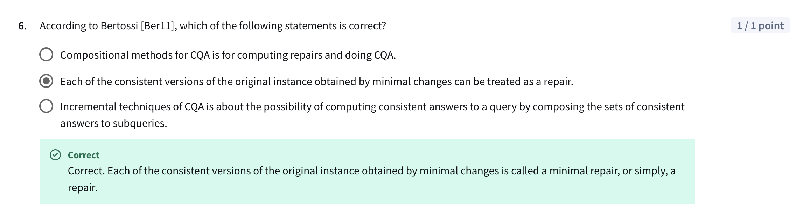
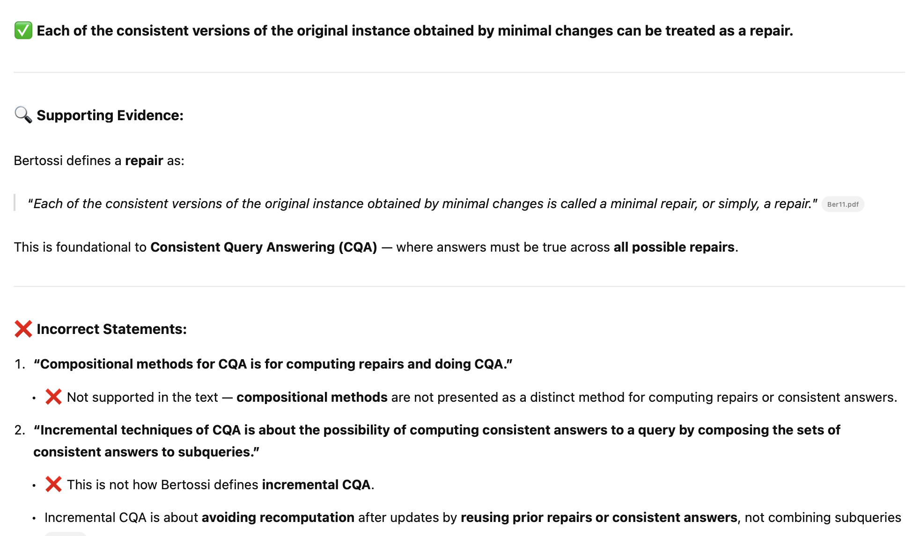

# 7
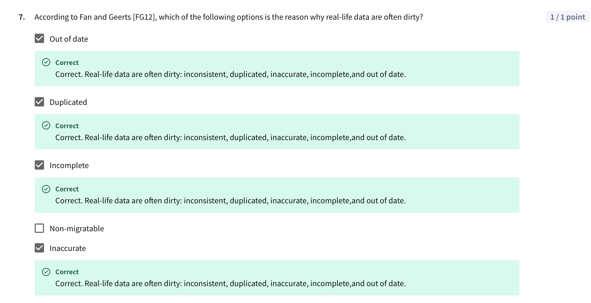
From book: 
“Unfortunately, real-life data are often dirty: inconsistent, duplicated, inaccurate, incomplete, and out of date.” 

# 8
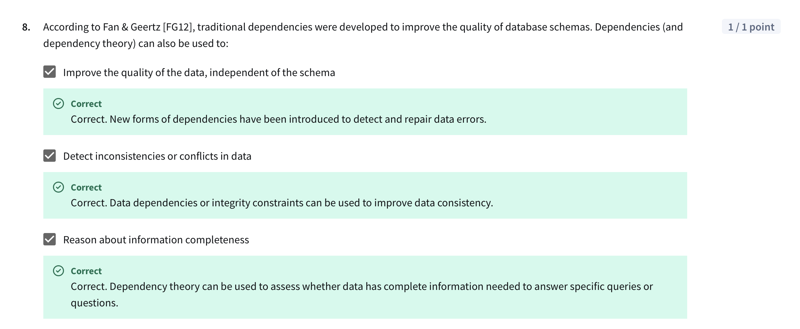
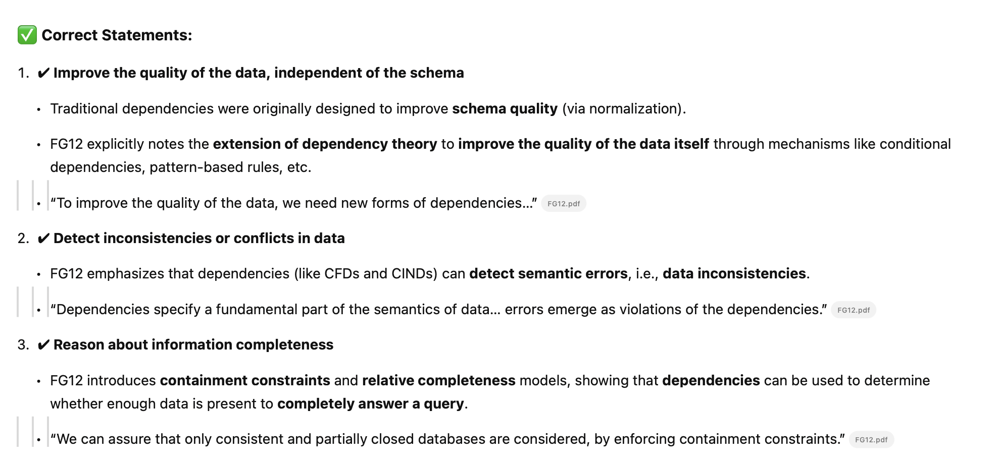
