# 1
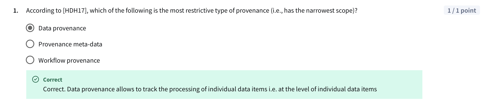
From the paper [HDH17], the authors distinguish multiple types of provenance:
> •	Data provenance focuses on where data values came from, i.e., their lineage or origin at the record or field level.
> •	Provenance metadata expands on this to include descriptive information about how the data was produced.
> •	Workflow provenance captures the entire process or pipeline — including tools, parameters, versions, and control/data flow — that produced the result.
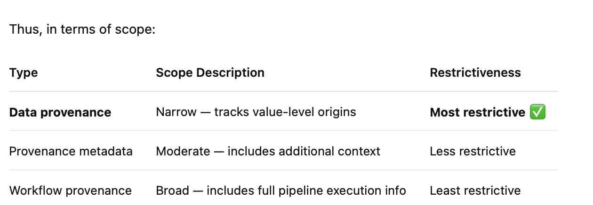

---
# 2
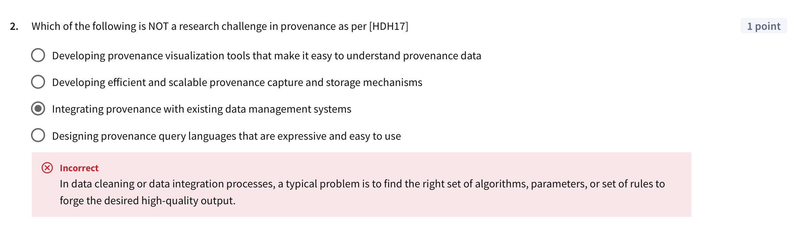
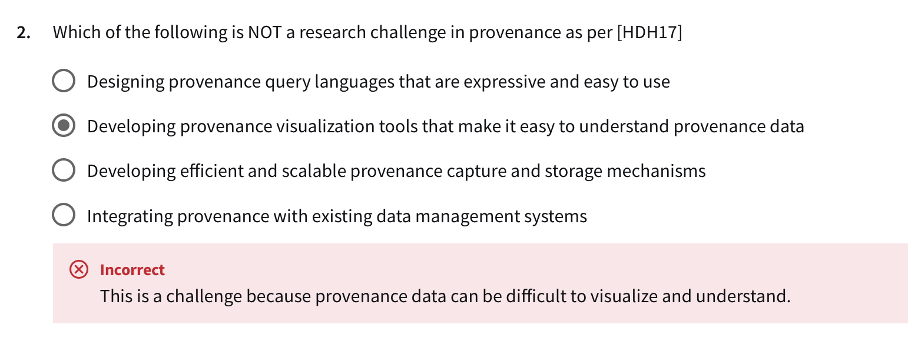
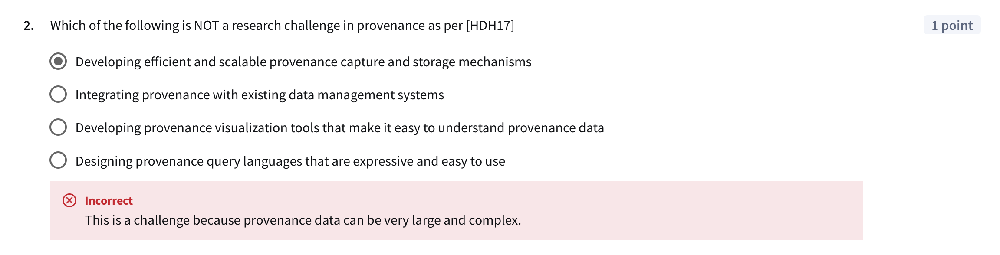
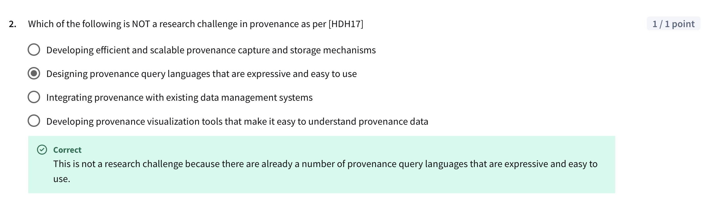

---
# 3
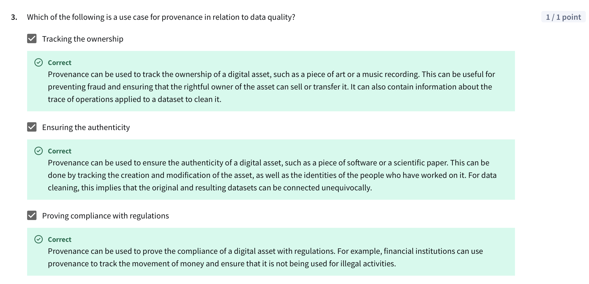

----
# 4
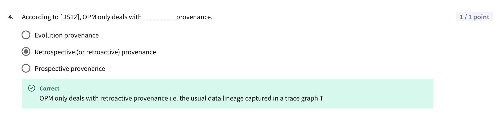

---
# 5
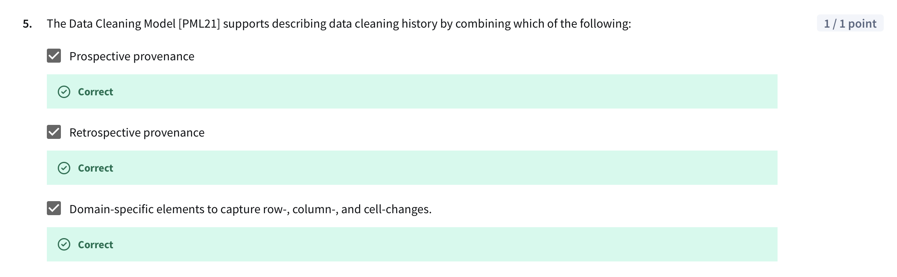
---
# 6
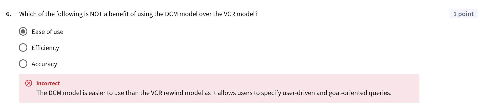
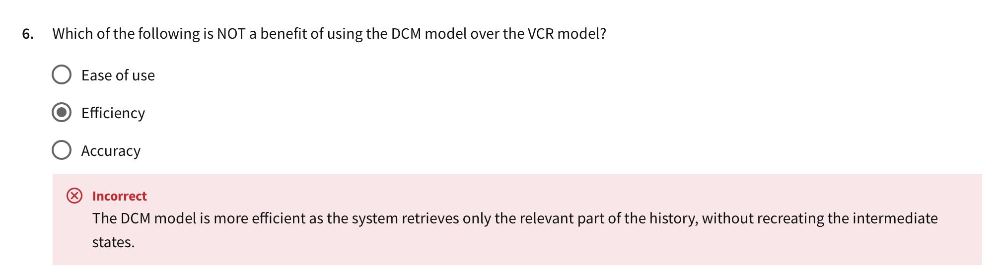
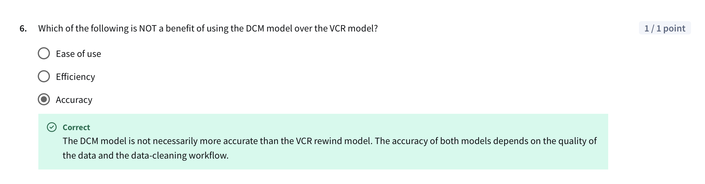

## ✅ DCM – Data Cleaning Model

From [PML21], DCM is a provenance-aware framework for describing what, how, and why changes were made during data cleaning. It:
	•	Captures both prospective and retrospective provenance
	•	Records changes at row-, column-, and cell-level
	•	Supports explaining and verifying cleaning actions

Think of DCM as a detailed cleaning log with structured provenance metadata.

⸻

##  ✅ VCR – Versioned Cell Record

VCR is a prior model for capturing cell-level data changes during cleaning. It:
	•	Maintains a versioned history of changes to each cell
	•	Tracks how values evolve over time
	•	Is granular but lacks rich contextual metadata

Think of VCR as a time-stamped ledger for each cell’s value, but without the big picture.

---
# 7
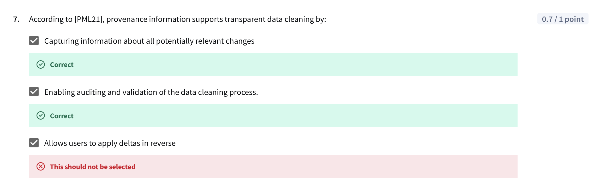
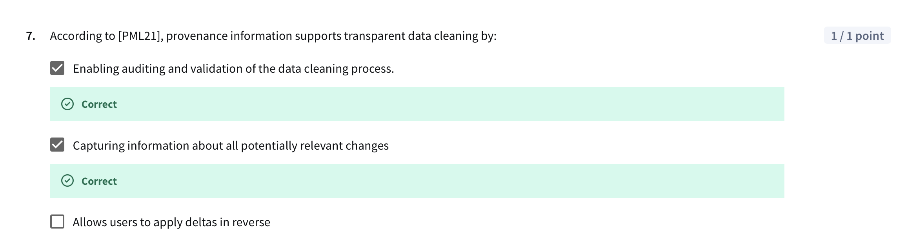
