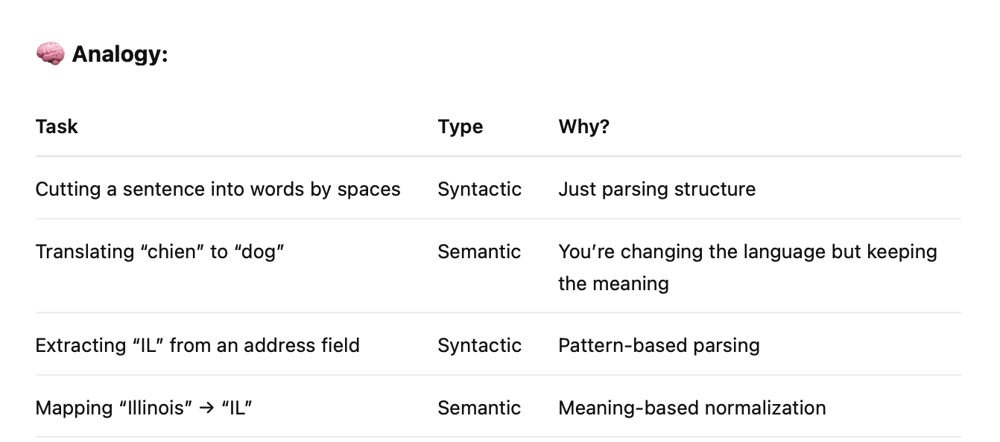
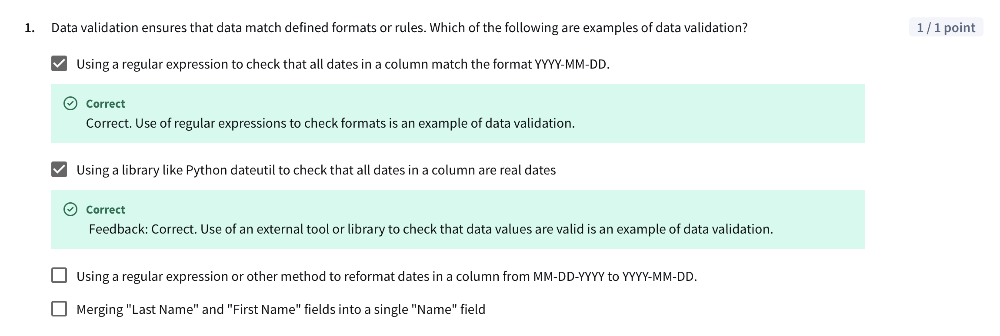
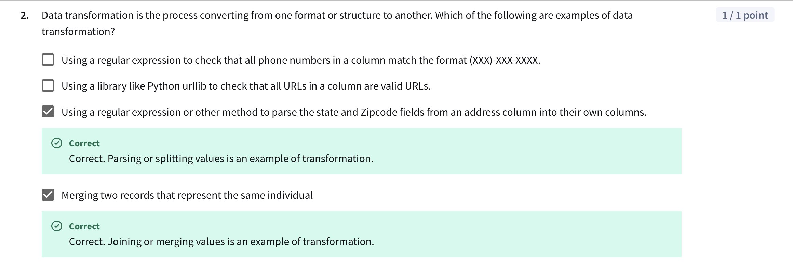
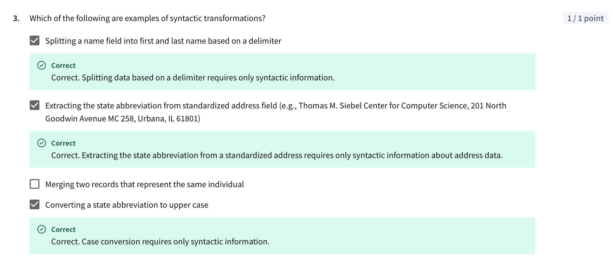
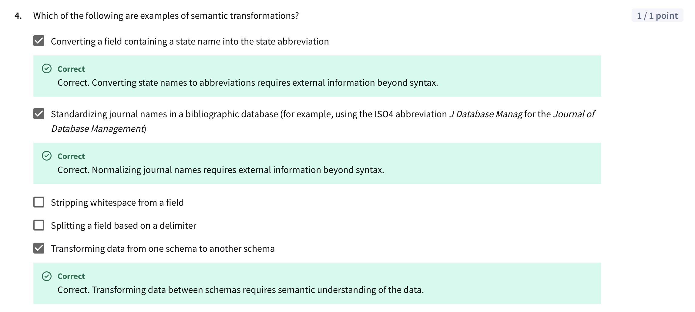
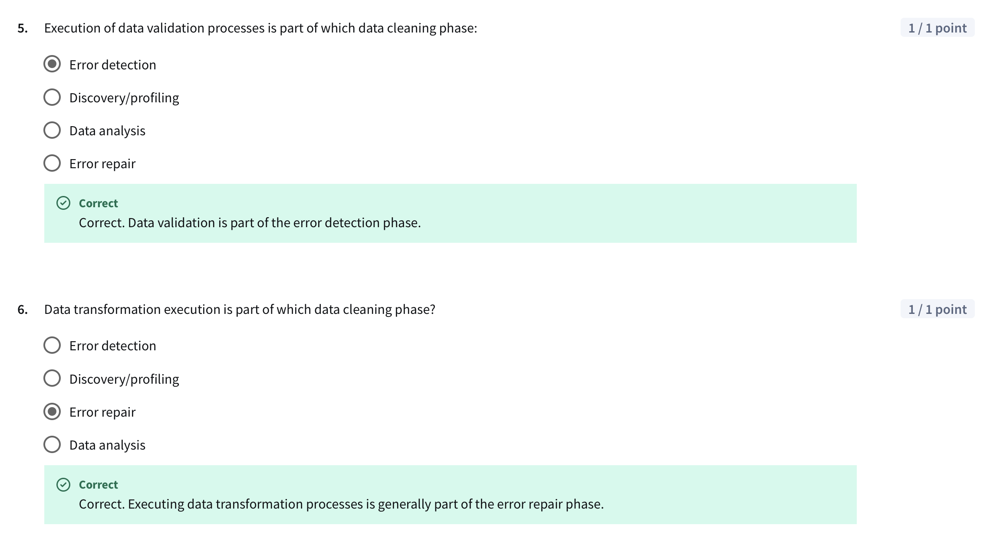
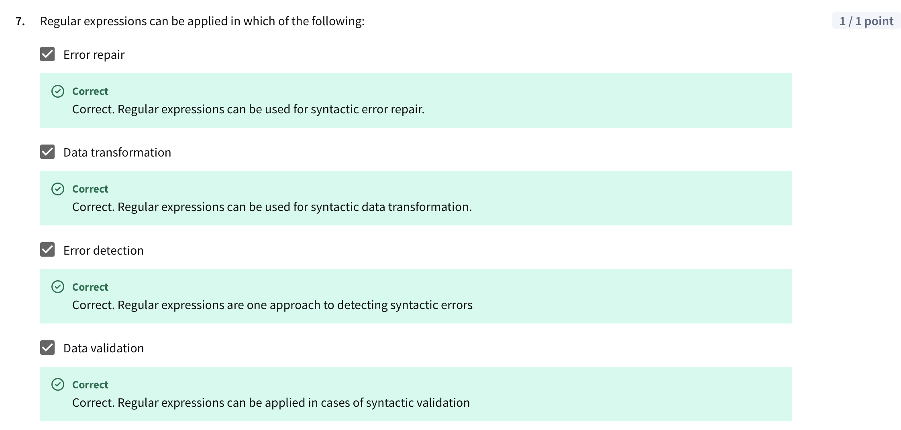
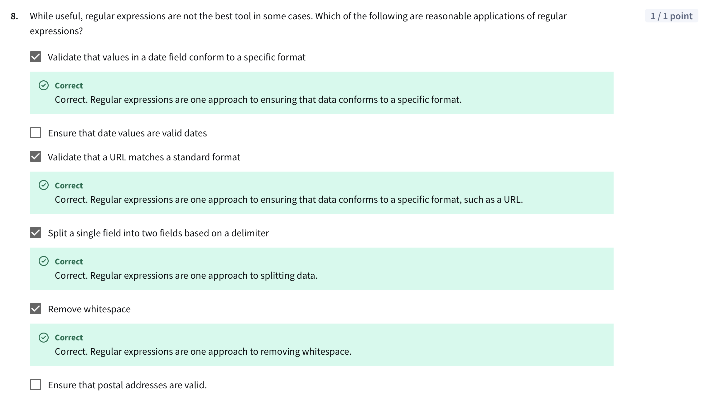

# My learning
> - **Syntactic transformation** = Restructuring or formatting data without altering its meaning
> - **Semantic transformations** = involve aligning data based on meaning, not just format or structure.

# Q & A

# 2

# 3

# 4

# 5 and 6

# 7

# 8
