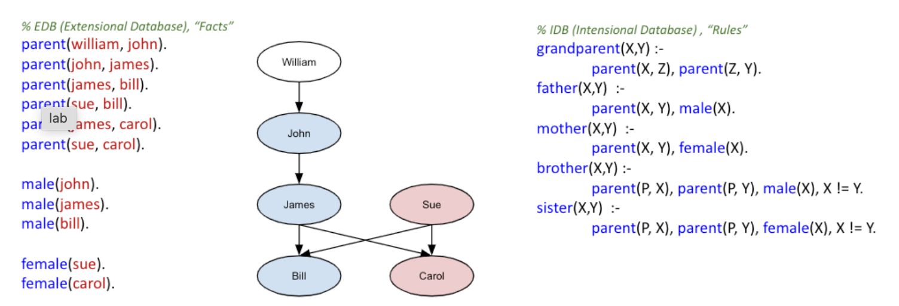

# Instructions
## Problem 1: Rules and Integrity Constraints (Family Data)

Notes about Datalog (Clingo) in the Jupyter Notebook environment:

* Refer to  [Clingo with Jupyter Intro](https://instructorbusdovze.labs.coursera.org/notebooks/source/datalog_2/Clingo_with_Jupyter_Intro.ipynb)
 before attempting this notebook.
* It is important to run the following cells first for the rest of  the notebook to work. (It's usually a good idea to run cells in order.  In case you have run cells out of order and want to start over, simply  restart the kernel from the menu.)
All clingo cells start with **%%clingo**.
You can run your clingo cell against the facts and rules from a file.**set_db_file** $filepath sets the file against which your clingo cells will run.
The clingo cells are independent of each other. Rules defined in one cell won't be visible in others!
When you submit the assignment, we will run your code against different sets of facts. (So don't "hardcode" your answers ;-)
If you want to practice a bit more with clingo, you can go to  https://potassco.org/clingo/run/
 and experiment with the small (but interesting!) examples there. Alternatively, you can install clingo on your own computer:  https://potassco.org/doc/start
. If you want to go "all in", there is also an online course (https://teaching.potassco.org/). 
But don't worry: none of this is required to do this assignment!

FYI: %%clingo is just a thin wrapper for running the tool in command line mode.
Family data and rules in Datalog (clingo):

Consider the family relation which is shown as a graph below (edges  point from a parent to a child)! We will work with Datalog rules to  query data from this graph and check for integrity violations. 

# Problem 1: Rules and Integrity Constraints (Family Data)

### Family data and rules in Datalog (clingo):
Consider the family relation which is shown as a graph below (edges point from a parent to a child)!
 We will work with Datalog rules to query data from this graph and check for integrity violations.


code
```
%reload_ext lib.clingo.clingo_magic
import os
from lib.clingo.clingo_evaluate_util import clingo_evaluate
```

code
```
# All clingo cells will run against this file containing some base facts.
family_base_facts_and_rules_file = os.path.expanduser('~/data_readonly/datalog/family_base.lp')
%set_db_file $family_base_facts_and_rules_file
```

**Results**
> % EDB (Extensional Database), "Facts"
 2 % parent(P, C) <=> P is_parent_of C
 3 parent(william, john).
 4 parent(john, james).
 5 parent(james, bill).
 6 parent(sue, bill).
 7 parent(james, carol).
 8 parent(sue, carol).
 9 
10 male(john).
11 male(james).
12 male(bill).
13 
14 female(sue).
15 female(carol).
16 
17 % IDB (Intensional Database) / RULES
18 grandparent(X,Y) :- parent(X, Z), parent(Z, Y).
19 father(X,Y)  :-     parent(X, Y), male(X).
20 mother(X,Y)  :-     parent(X, Y), female(X).
21 brother(X,Y) :-     parent(P, X), parent(P, Y), male(X), X != Y.
22 sister(X,Y)  :-     parent(P, X), parent(P, Y), female(X), X != Y.

## We will now write various rules one by one ...

[12.5 points] descendant(X,Y)
descendant(X,Y) holds if X is a descendant of Y. Hint: We did the closely related ancestor(X,Y) in class.

```
%%clingo {"predicate" : "descendant", "predicate_arity" : 2, "result_var": "Descendant"}
% Don't change the clingo magic command above. The header of this cell will determine how the datalog rules are saved for evaluation.


% Change following expression.
descendant(X,Y) :- replace_me(X,Y).
```