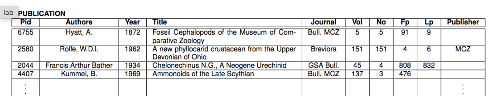
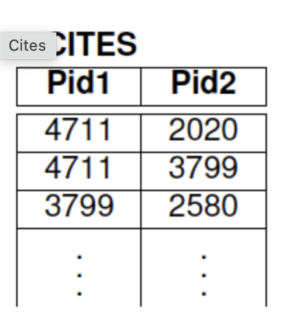

# Checking complex ICs on a simple publications dataset

> - In this problem, consider a “dirty” dataset such as the file  “publications” posted in class. In order to improve the data quality of  the original dataset, a reasonable approach is to first apply OpenRefine  and then import the “OR-cleaned” dataset into a database. The  IC-checking capabilities of database queries are a powerful way to  detect inconsistencies.

> - For this problem, assume that the "pre-cleaned" dataset (i.e., after  using OpenRefine) has been loaded into a table of a relational database  as shown below. We are going to write rules (Datalog/clingo queries) to  check ICs of data from the table. 



```
%reload_ext lib.clingo.clingo_magic
import os
from lib.clingo.clingo_evaluate_util import clingo_evaluate
```

```
# All clingo cells will run against this file containing some base facts.
publications_base_facts_and_rules_file = os.path.expanduser('~/data_readonly/datalog/publications_base.lp')
%set_db_file $publications_base_facts_and_rules_file
```

**Result**
```
% Assume that the table is available as a Datalog predicate of the form
 2 % publication(I, A, Y, T, J, V, N, F, L, P).
 3 
 4 % Here are some entries, loosely based on the records shown on the assignment
 5 publication(6755, hyatt, 1872, fossil, bullmcz, 5, 5, 91, 9, publisher1).
 6 publication(2580, rolfe, 1962, phyllocarid, breviora, 151, 151, 4, 6, mcz).
 7 publication(2044, bather, 1934, chelonechinus, gsa, 45, 4, 808, 832, null).
 8 publication(4407, kummel, 1969, ammonoids, bullmcz, 137, 3, 476, null, publisher2).
 9 
10 % Some additional publication to test IC violation
11 publication(4407, doe, 2015, foobar, bullmcz, 10, 1, 10, 1, null).
12 
13 % cites(Pid1, Pid2) says that Pid1 is citing Pid2, i.e., Pid2 is cited.
14 cites(4711, 2020).
15 cites(4711, 3799).
16 cites(3799, 2580).
17 
18 % Some more citations to test IC violation
19 cites(2580, 2044).
20 cites(2044, 2580).
```

__ASK:
You will now write various rules to find "bad" (i.e., inconsistent) data
[10 points] The key attribute ID should uniquely determine all other attributes.
In DENIAL form we report all IC violations, i.e., where there are at least two rows having the same ID, but some differing attributes somewhere.
You can assume that the table is available as a Datalog predicate of the form publication(I,A,Y,T,J,V,N,F,L,P). Recall that in Datalog, arbitrary (capitalized) names can be chosen as variables, since it is the argument position that determines which attribute/column is meant.
(FD-1) The publication identifier Pid is a key, i.e., if a row agrees with another row on the key attribute Pid, then it also agrees on all other attributes (i.e., the “two” rows are in fact one and the same). As usual, your rule should return the IC-violations.
Here we report both the name of the attribute and the duplicate values.

# Code:
```
%%clingo {"predicate" : "icv_pid_key", "predicate_arity" : 4, "result_var": "Icv_pid_key"}
% Don't change the clingo magic command above. The header of this cell will determine how the datalog rules are saved for evaluation.

% Following code snippet and it's result will be assigned to local variable Icv_pid_key

% Change following expressions.
% In DENIAL form we report all IC violations, i.e., where there are at least two rows
% having the same ID, but some differing attributes somewhere.
% Here we report both the name of the attribute and the duplicate values.
% icv_pid_key(ID,author,A1,A2) :-    replace_me_fd1(ID,A1,A2).
% icv_pid_key(ID,year,Y1,Y2) :-      replace_me_fd1(ID,Y1,Y2).
% icv_pid_key(ID,title,T1,T2) :-     replace_me_fd1(ID,T1,T2).
% icv_pid_key(ID,journal,J1,J2) :-   replace_me_fd1(ID,J1,J2).
% icv_pid_key(ID,vol,V1,V2) :-       replace_me_fd1(ID,V1,V2).
% icv_pid_key(ID,no,N1,N2) :-        replace_me_fd1(ID,N1,N2).
% icv_pid_key(ID,fp,F1,F2) :-        replace_me_fd1(ID,F1,F2).
% icv_pid_key(ID,lp,L1,L2) :-        replace_me_fd1(ID,L1,L2).
% icv_pid_key(ID,publisher,P1,P2) :- replace_me_fd1(ID,P1,P2).
    
icv_pid_key(ID,author,A1,A2) :- 
    publication(ID, A1, _, _, _, _, _, _, _, _), 
    publication(ID, A2, _, _, _, _, _, _, _, _), 
    A1 != A2.

icv_pid_key(ID,year,Y1,Y2) :- 
    publication(ID, _, Y1, _, _, _, _, _, _, _), 
    publication(ID, _, Y2, _, _, _, _, _, _, _), 
    Y1 != Y2.

icv_pid_key(ID,title,T1,T2) :- 
    publication(ID, _, _, T1, _, _, _, _, _, _), 
    publication(ID, _, _, T2, _, _, _, _, _, _), 
    T1 != T2.

icv_pid_key(ID,journal,J1,J2) :- 
    publication(ID, _, _, _, J1, _, _, _, _, _), 
    publication(ID, _, _, _, J2, _, _, _, _, _), 
    J1 != J2.

icv_pid_key(ID,vol,V1,V2) :- 
    publication(ID, _, _, _, _, V1, _, _, _, _), 
    publication(ID, _, _, _, _, V2, _, _, _, _), 
    V1 != V2.

icv_pid_key(ID,no,N1,N2) :- 
    publication(ID, _, _, _, _, _, N1, _, _, _), 
    publication(ID, _, _, _, _, _, N2, _, _, _), 
    N1 != N2.

icv_pid_key(ID,fp,F1,F2) :- 
    publication(ID, _, _, _, _, _, _, F1, _, _), 
    publication(ID, _, _, _, _, _, _, F2, _, _), 
    F1 != F2.

icv_pid_key(ID,lp,L1,L2) :- 
    publication(ID, _, _, _, _, _, _, _, L1, _), 
    publication(ID, _, _, _, _, _, _, _, L2, _), 
    L1 != L2.

icv_pid_key(ID,publisher,P1,P2) :- 
    publication(ID, _, _, _, _, _, _, _, _, P1), 
    publication(ID, _, _, _, _, _, _, _, _, P2), 
    P1 != P2.
```

## Result:
icv_pid_key(4407,author,doe,kummel) icv_pid_key(4407,author,kummel,doe) icv_pid_key(4407,year,2015,1969) icv_pid_key(4407,year,1969,2015) icv_pid_key(4407,title,foobar,ammonoids) icv_pid_key(4407,title,ammonoids,foobar) icv_pid_key(4407,vol,10,137) icv_pid_key(4407,vol,137,10) icv_pid_key(4407,no,1,3) icv_pid_key(4407,no,3,1) icv_pid_key(4407,fp,10,476) icv_pid_key(4407,fp,476,10) icv_pid_key(4407,lp,1,null) icv_pid_key(4407,lp,null,1) icv_pid_key(4407,publisher,null,publisher2) icv_pid_key(4407,publisher,publisher2,null)

# ASK 
[10 points] Every journal has a single publisher: icv_journal_publisher/3
(FD-2) Every Journal has a single Publisher.
Like (FD-1), this is a functional dependency. It is sometimes written as Journal —> Publisher.
As usual, we use denial mode and report the journals which have more than one publisher.

```
%%clingo {"predicate" : "icv_journal_publisher", "predicate_arity" : 3, "result_var": "Icv_journal_publisher"}
% Don't change the clingo magic command above. The header of this cell will determine how the datalog rules are saved for evaluation.

% Following code snippet and it's result will be assigned to local variable Icv_journal_publisher

% icv_journal_publisher(J,P1,P2) :- replace_me_fd2(J,P1,P2).
icv_journal_publisher(J,P1,P2) :- 
    publication(_, _, _, _, J, _, _, _, _, P1), 
    publication(_, _, _, _, J, _, _, _, _, P2), 
    P1 < P2.
```

# ASK 3:
[10 points] The last page (Lp) cannot be smaller than the first page (Fp)
(NC-1) The last page Lp cannot be smaller than the first page Fp.
This numerical constraint can be evaluated independently on each row.
In denial form, we report publication IDs for which the last page is smaller than the first.

# CODE
```
%%clingo {"predicate" : "icv_firstpage_lastpage", "predicate_arity" : 3, "result_var": "Icv_firstpage_lastpage"}
% Don't change the clingo magic command above. The header of this cell will determine how the datalog rules are saved for evaluation.

% Following code snippet and it's result will be assigned to local variable Icv_firstpage_lastpage

% Change following expression.
icv_firstpage_lastpage(ID,F,L) :- publication(ID, _, _, _, _, _, _, F, L, _), L < F.

% replace_me_nc1(ID,F,L).

```

# ASK 4
[10 points] Inclusion Dependency: Every cited publication in CITES also occurs in PUBLICATION.
Now consider that an additional table cites(Pid1, Pid2) is given which records pairs of publication Pid1, Pid2, where Pid1 is citing Pid2.


> - (ID) Every cited publication Pid2 occurs in the publication table!
> - In denial form, we report in icv_cited_publication/1 any and all cited publications from CITES that are not also in PUBLICATION.

## CODE
```
%%clingo {"predicate" : "icv_cited_publication", "predicate_arity" : 1, "result_var": "Icv_cited_publication"}
% Don't change the clingo magic command above. The header of this cell will determine how the datalog rules are saved for evaluation.

% Following code snippet and it's result will be assigned to local variable Icv_cited_publication

% Change following expression.
%(Inclusion Dependency): Every cited publication in CITES also occurs in PUBLICATION.
icv_cited_publication(P2) :- replace_me_id(P2).

```
# ASK 5
[10 points] If P1 cites P2 then P2's year of publication cannot be greater than P1.
As usual we use denial form and report publications P1 that cite P2 where the cited publication's year Y2 is larger than the citing publication's year Y1 (i.e., P1 is "looking into the future" - which is supicious and needs to be reported ;-)

## CODE
```
%%clingo {"predicate" : "icv_p1_greater_p2", "predicate_arity" : 4, "result_var": "Icv_p1_greater_p2"}
% Don't change the clingo magic command above. The header of this cell will determine how the datalog rules are saved for evaluation.

% Following code snippet and it's result will be assigned to local variable Icv_p1_greater_p2

% Change following expression.
icv_p1_greater_p2(P1,P2,Y1,Y2) :- replace_me_nc2(P1,P2,Y1,Y2).
```

# ASK 6
[10 points] If P1 cites P2 then P2's year of publication cannot be greater than P1.
As usual we use denial form and report publications P1 that cite P2 where the cited publication's year Y2 is larger than the citing publication's year Y1 (i.e., P1 is "looking into the future" - which is supicious and needs to be reported ;-)

### CODE
```
%%clingo {"predicate" : "icv_p1_greater_p2", "predicate_arity" : 4, "result_var": "Icv_p1_greater_p2"}
% Don't change the clingo magic command above. The header of this cell will determine how the datalog rules are saved for evaluation.

% Following code snippet and it's result will be assigned to local variable Icv_p1_greater_p2

% Change following expression.
% icv_p1_greater_p2(P1,P2,Y1,Y2) :- replace_me_nc2(P1,P2,Y1,Y2).

icv_p1_greater_p2(P1, P2, Y1, Y2) :- 
    cites(P1, P2),
    publication(P1, _, Y1, _, _, _, _, _, _, _),
    publication(P2, _, Y2, _, _, _, _, _, _, _),
    Y2 > Y1.

```