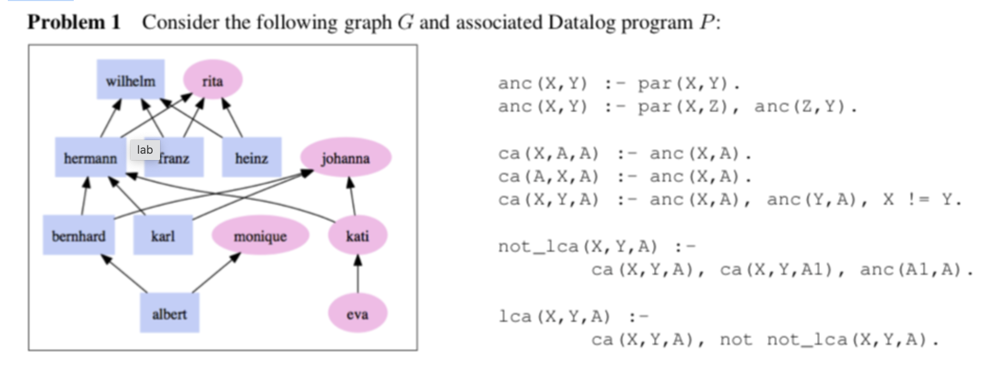

# Provenance Queries: Family Relations

This assignment uses Datalog rules, so refer to the earlier Datalog assignment before attempting this notebook.
As usual, run the cells in order (Perform "restart and run all" to have complete evaluation) .  All Datalog (clingo) cells start with **%%clingo.**
You can run your clingo cell against the facts and rules from a file. **set_db_file $filepath** sets the file against which your clingo cells will run.
The clingo cells are independent of each other. Rules defined in one cell won't be visible in others!
When you submit the assignment, we will run your code against different sets of facts. (So don't "hardcode" your answers ;-)
# Family data and rules in Datalog (clingo):
Consider the family relation which is shown as a graph below! We will work with Datalog rules to query data from this graph and check for integrity violations.



> - In this assignment you will be using Datalog as a query language for provenance. Provenance graphs are directed, acyclic graphs (DAGs), connecting nodes (e.g., data elements, workflow steps, etc.) through directed edges. Edges typically model dataflow, e.g., read and write events in the case of retrospective provenance information, or in and out edges in a prospective provenance graph (i.e., a workflow graph).
> - Similarly, provenance graphs might also represent the “backward dependencies” (_used_, _wasGeneratedBy_) of the Open Provenance Model (OPM) or the W3C PROV model.
> - Problem 1 resumes the “family relations” theme from an earlier assignment, using relationships that are useful when querying data provenance graphs. For example, a recursively defined relation such as anc(x,y) (for ancestor) can be used to trace the lineage of a data product from a workflow run.
> - Here, in graph G there is an edge from X to Y, if X is a child of Y, or equivalently, if X has_parent Y. In the Datalog program P this is represented by a fact par(X,Y). The rules for anc(X,Y) define the transitive ancestor relation, i.e., anc(X,Y) is true if one can reach from X an ancestor Y via a chain of parent edges. Similarly, ca(X,Y,A) means that A is a common ancestor of X and Y, and lca(X,Y,A) means that A is the least common ancestor (LCA) of X and Y. To compute the LCA, we use an auxiliary relation not_lca(X,Y,A), which states that A is not the LCA of X and Y, since there exists another, lower common ancestor A1.

## Code
```
%reload_ext lib.clingo.clingo_magic
import os
from lib.clingo.clingo_evaluate_util import clingo_evaluate
```

# All clingo cells will run against this file containing the base facts.
```
family_base_facts_and_rules_file = os.path.expanduser('~/data_readonly/provenance/problem1-lca.lp')
%set_db_file $family_base_facts_and_rules_file
```

> Results
>  % The parent facts par(Child, Parent)
 2 par(albert,bernhard). 
 3 par(albert,monique).
 4 par(bernhard,hermann). 
 5 par(bernhard,johanna).
 6 par(eva,kati).
 7 par(franz,rita). 
 8 par(franz,wilhelm).  
 9 par(heinz,rita). 
10 par(heinz,wilhelm).
11 par(hermann,rita).
12 par(hermann,wilhelm). 
13 par(karl,hermann). 
14 par(karl,johanna). 
15 par(kati,hermann).
16 par(kati,johanna).

# [5 points] 1. Albert's ancestors
## Write a Datalog rule for finding the ancestors of albert.

```
%%clingo {"predicate" : "ancestor_albert", "predicate_arity" : 1, "result_var": "Ancestor_albert"}
% Don't change the clingo magic command above. The header of this cell will determine how the datalog rules are saved for evaluation.

% Change the following expression:
anc(X,Y) :- par(X,Y).
anc(X,Y) :- par(X,Z), anc(Z,Y).
ancestor_albert(X) :- anc(albert, X).
```

---

# [5 points] 2. Eva's ancestors
## Write a Datalog rule for finding the ancestors of eva.

```
%%clingo {"predicate" : "ancestor_eva", "predicate_arity" : 1, "result_var": "Ancestor_eva"}
% Don't change the clingo magic command above. The header of this cell will determine how the datalog rules are saved for evaluation.

% Change the following expressions:
anc(X,Y) :- par(X,Y).  % Base Case
anc(X,Y) :- par(X,Z), anc(Z,Y).  % Recursive Case

ancestor_eva(X) :- anc(eva, X).
```

### 3. Common Ancestors of Albert and Eva
Write a Datalog rule for finding the common ancestors of _albert_ and _eva_.

```
%%clingo {"predicate" : "ca_albert_eva", "predicate_arity" : 1, "result_var": "Ca_albert_eva"}
% Don't change the clingo magic command above. The header of this cell will determine how the datalog rules are saved for evaluation.

% Correct transitive ancestor relation
anc(X,Y) :- par(X,Y).
anc(X,Y) :- par(X,Z), anc(Z,Y).

% A is a common ancestor of both X and Y
ca(X,Y,A) :- anc(X,A), anc(Y,A).

% Output only the common ancestors of albert and eva
ca_albert_eva(X) :- ca(albert, eva, X).
```

# 4. Which of the common ancestors in (3) are LCAs?
Write Datalog rules for the lowest common ancestors for albert and eva.

```
%%clingo {"predicate" : "lca_albert_eva", "predicate_arity" : 1, "result_var": "Lca_albert_eva"}
% Don't change the clingo magic command above. The header of this cell will determine how the datalog rules are saved for evaluation.

% Change the following expressions:
anc(X,Y) :- par(X,Y).
anc(X,Y) :- par(X,Z), anc(Z,Y).

ca(X,Y,A) :- anc(X,A), anc(Y,A).

% Provide rules for not_lca
not_lca(X, Y, A) :- anc(X, A), anc(Y, A), anc(A1, A), anc(X, A1), anc(Y, A1).
lca(X,Y,A) :- ca(X,Y,A), not not_lca(X,Y,A).
    
lca_albert_eva(X) :- lca(albert, eva, X).
```

# 5. Which of the common ancestors in (3) are not LCAs?
> Write Datalog rules for the common ancestor of albert and eva that are not LCAs.

```
%%clingo {"predicate" : "nlca_albert_eva", "predicate_arity" : 1, "result_var": "Nlca_albert_eva"}
% Don't change the clingo magic command above. The header of this cell will determine how the datalog rules are saved for evaluation.

% Change following expression.
anc(X,Y) :- replace_me(X,Y).

ca(X,Y,A) :- replace_me(X,Y,A). 

% provide negative rules for not lca
not_lca(X,Y,A) :- replace_me(X,Y,A).

lca(X,Y,A) :- replace_me(X,Y,A).

nlca_albert_eva(X) :- replace_me(X).
```

# 5.Updated
```
%%clingo {"predicate" : "nlca_albert_eva", "predicate_arity" : 1, "result_var": "Nlca_albert_eva"}
% Don't change the clingo magic command above. The header of this cell will determine how the datalog rules are saved for evaluation.

% Base and recursive ancestor rules
anc(X,Y) :- par(X,Y).
anc(X,Y) :- par(X,Z), anc(Z,Y).

% A is a common ancestor of X and Y
ca(X,Y,A) :- anc(X,A), anc(Y,A).

% A is not the least common ancestor if there's a deeper one A1
not_lca(X,Y,A) :- anc(X,A), anc(Y,A), anc(A1,A), anc(X,A1), anc(Y,A1).

% A is the least common ancestor if it's a common ancestor and not ruled out
lca(X,Y,A) :- ca(X,Y,A), not not_lca(X,Y,A).

% A is a common ancestor but not the LCA
nlca_albert_eva(X) :- ca(albert, eva, X), not lca(albert, eva, X).
```