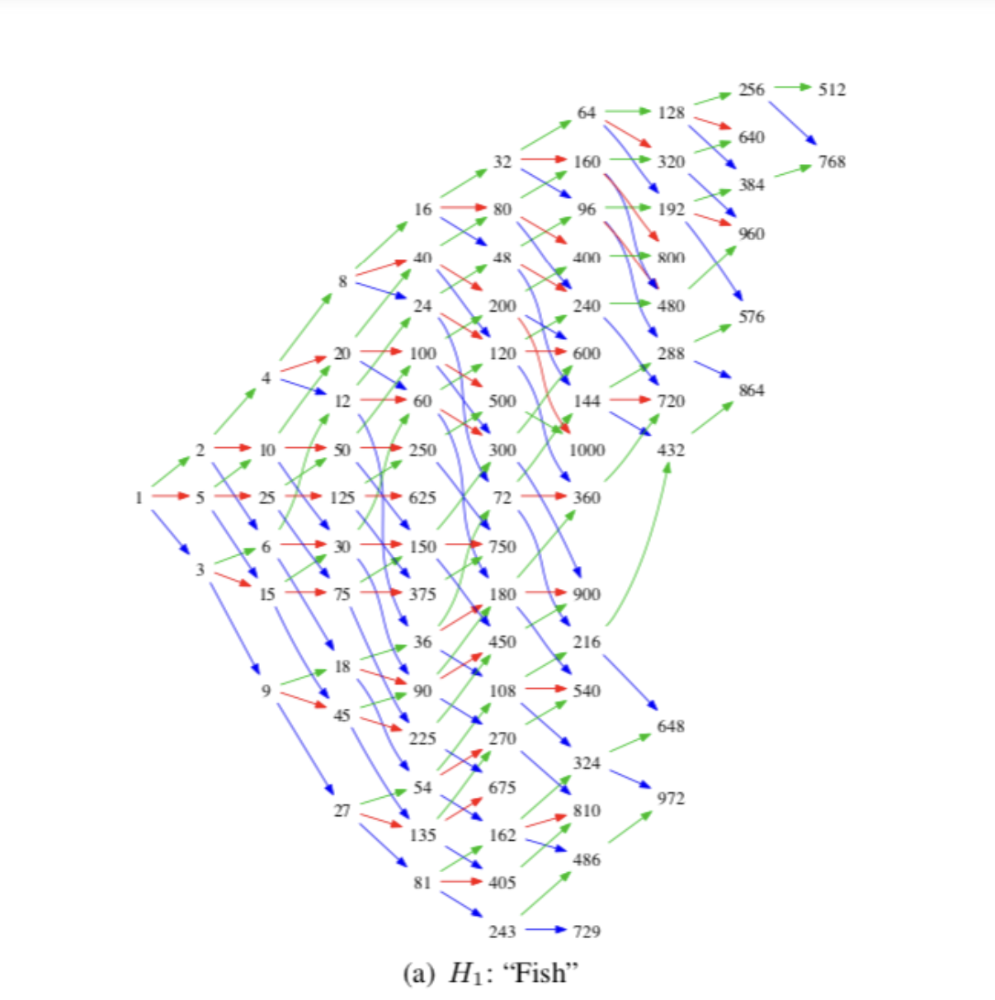
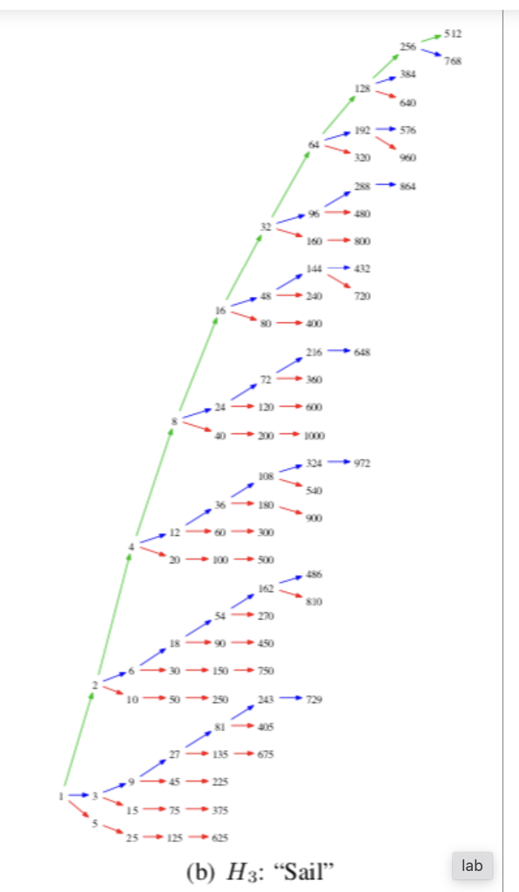
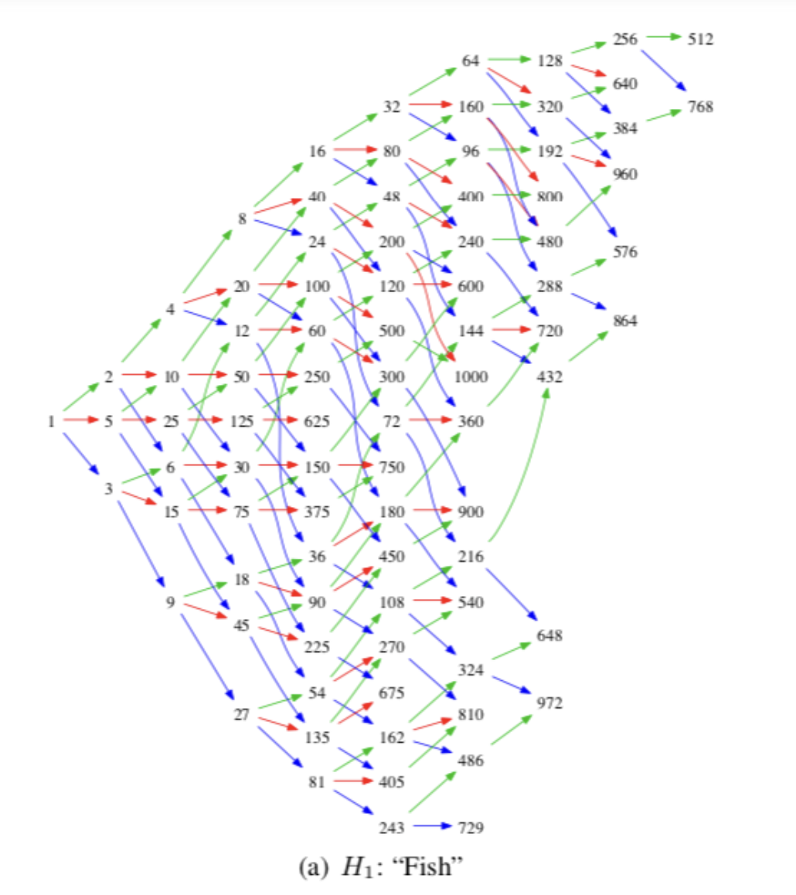
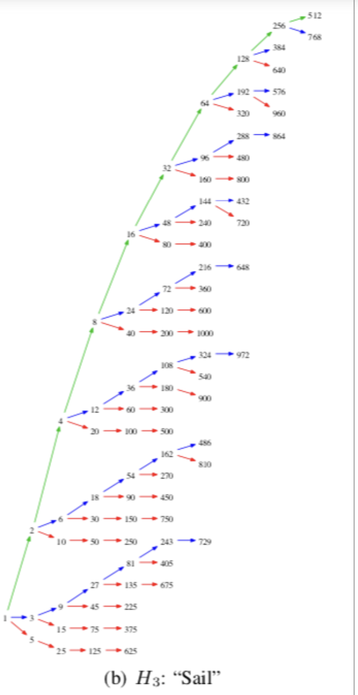
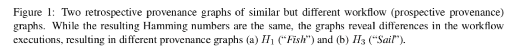
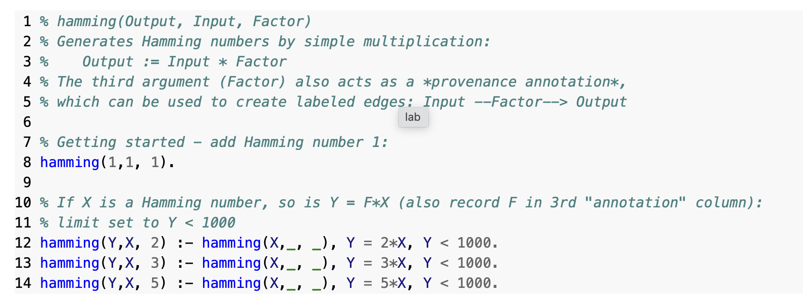

# Problem 2: Hamming Numbers

Two retrospective provenance graphs from two similar but different workflows graphs (prospective  provenance).  While the resulting Hamming numbers  are the same, the graphs reveal  differences in the workflow executions, resulting in different  provenance graphs 

> - (a) H1 (“Fish”) and 
> - (b) H3 (“Sail”).

(See https://en.wikipedia.org/wiki/Regular_number
 if you'd like to know more about Hamming numbers.)

This assignment is for "Fish" type of provenance graph (30 points)

This [paper and presentation](https://www.usenix.org/conference/tapp12/workshop-program/presentation/dey) on Datalog as a Lingua Franca for Provenance Querying and Reasoning is also relevant and uses the Fish and Sail provenance graphs in the appendix.

# Fish Diagram


# Sail Diagram


> We study _retrospective_ provenance graphs resulting from  similar but different executable workflows graphs (_prospective_ provenance). While the resulting outputs (Hamming numbers)  are the same, the graphs reveal differences in the underlying workflow executions, resulting in two different provenance graphs: 
- (a) H1: _Fish_ and 
- (b) H3: _Sail_.

If you'd like to know more about Hamming numbers, see https://en.wikipedia.org/wiki/Regular_number. This [paper and presentation](https://www.usenix.org/conference/tapp12/workshop-program/presentation/dey) on _Datalog as a Lingua Franca for Provenance Querying and Reasoning_ is also relevant and uses the _Fish_ and _Sail_ provenance graphs in the appendix.

---

### (a) Fish


---
### (b) H3: "Sail"


---


---

## Problem 2a: Fish

**Hints**. To solve Problem 2, you can reuse the rules from Problem 1: use the relation `hamming(Y,X,F)` to define a new “parent” relation `par(X,Y)`. Using this new parent relation (obtained from the Hamming edges), you can reuse the rules for `anc(X,Y)`, `ca(X,Y,A)`, `not_lca(X,Y,A)`, and `lca(X,Y,A)` to solve Problem 2!


```
%reload_ext lib.clingo.clingo_magic
import os
from lib.clingo.clingo_evaluate_util import clingo_evaluate
```

```
family_base_facts_and_rules_file = os.path.expanduser('~/data_readonly/provenance/problem2-fish.lp')
%set_db_file $family_base_facts_and_rules_file
```

**Output:**


## Hamming test

```
%%clingo {"predicate" : "hamming", "predicate_arity" : 3, "result_var": "Hamming_test"}
% Hamming Test
```
**Output:**
```
hamming(1,1,1) hamming(5,1,5) hamming(3,1,3) hamming(2,1,2) hamming(10,2,5) hamming(15,3,5) hamming(25,5,5) hamming(6,2,3) hamming(9,3,3) hamming(15,5,3) hamming(4,2,2) hamming(6,3,2) hamming(10,5,2) hamming(50,10,5) hamming(30,6,5) hamming(20,4,5) hamming(75,15,5) hamming(45,9,5) hamming(125,25,5) hamming(30,10,3) hamming(18,6,3) hamming(12,4,3) hamming(45,15,3) hamming(27,9,3) hamming(75,25,3) hamming(20,10,2) hamming(12,6,2) hamming(8,4,2) hamming(30,15,2) hamming(18,9,2) hamming(50,25,2) hamming(250,50,5) hamming(90,18,5) hamming(150,30,5) hamming(40,8,5) hamming(60,12,5) hamming(100,20,5) hamming(375,75,5) hamming(135,27,5) hamming(225,45,5) hamming(625,125,5) hamming(150,50,3) hamming(54,18,3) hamming(90,30,3) hamming(24,8,3) hamming(36,12,3) hamming(60,20,3) hamming(225,75,3) hamming(81,27,3) hamming(135,45,3) hamming(375,125,3) hamming(100,50,2) hamming(36,18,2) hamming(60,30,2) hamming(16,8,2) hamming(24,12,2) hamming(40,20,2) hamming(150,75,2) hamming(54,27,2) hamming(90,45,2) hamming(250,125,2) hamming(450,90,5) hamming(270,54,5) hamming(750,150,5) hamming(200,40,5) hamming(120,24,5) hamming(80,16,5) hamming(300,60,5) hamming(180,36,5) hamming(500,100,5) hamming(675,135,5) hamming(405,81,5) hamming(750,250,3) hamming(270,90,3) hamming(162,54,3) hamming(450,150,3) hamming(120,40,3) hamming(72,24,3) hamming(48,16,3) hamming(180,60,3) hamming(108,36,3) hamming(300,100,3) hamming(405,135,3) hamming(243,81,3) hamming(675,225,3) hamming(500,250,2) hamming(180,90,2) hamming(108,54,2) hamming(300,150,2) hamming(80,40,2) hamming(48,24,2) hamming(32,16,2) hamming(120,60,2) hamming(72,36,2) hamming(200,100,2) hamming(750,375,2) hamming(270,135,2) hamming(162,81,2) hamming(450,225,2) hamming(810,162,5) hamming(360,72,5) hamming(600,120,5) hamming(160,32,5) hamming(240,48,5) hamming(400,80,5) hamming(540,108,5) hamming(900,180,5) hamming(486,162,3) hamming(810,270,3) hamming(600,200,3) hamming(216,72,3) hamming(360,120,3) hamming(96,32,3) hamming(144,48,3) hamming(240,80,3) hamming(900,300,3) hamming(324,108,3) hamming(540,180,3) hamming(729,243,3) hamming(900,450,2) hamming(324,162,2) hamming(540,270,2) hamming(400,200,2) hamming(144,72,2) hamming(240,120,2) hamming(64,32,2) hamming(96,48,2) hamming(160,80,2) hamming(600,300,2) hamming(216,108,2) hamming(360,180,2) hamming(486,243,2) hamming(810,405,2) hamming(800,160,5) hamming(480,96,5) hamming(320,64,5) hamming(720,144,5) hamming(648,216,3) hamming(480,160,3) hamming(288,96,3) hamming(192,64,3) hamming(720,240,3) hamming(432,144,3) hamming(972,324,3) hamming(972,486,2) hamming(720,360,2) hamming(432,216,2) hamming(320,160,2) hamming(192,96,2) hamming(128,64,2) hamming(480,240,2) hamming(288,144,2) hamming(800,400,2) hamming(648,324,2) hamming(640,128,5) hamming(960,192,5) hamming(864,288,3) hamming(384,128,3) hamming(576,192,3) hamming(960,320,3) hamming(576,288,2) hamming(960,480,2) hamming(256,128,2) hamming(384,192,2) hamming(640,320,2) hamming(864,432,2) hamming(768,256,3) hamming(768,384,2) hamming(512,256,2)
```

# 1. [10 points] Ancestors 
> Compute the lineage of 360 in the Fish provenance graph, i.e., all nodes for which there is a path that leads to 360. You will do same for the Sail graph in the next notebook.

__CODE
```
%%clingo {"predicate" : "anc_360", "predicate_arity" : 1, "result_var": "Anc_360"}
% Don't change the clingo magic command above. The header of this cell will determine how the datalog rules are saved for evaluation.

%# Change the following expression, and add additional rules if necessary

anc_360(X) :- replace_me(X).
    
```

# PROBLEM 1: MODIFIED - partially working
```
%%clingo {"predicate" : "anc_360", "predicate_arity" : 1, "result_var": "Anc_360"}
% Don't change the clingo magic command above. The header of this cell will determine how the datalog rules are saved for evaluation.

%# Change the following expression, and add additional rules if necessary

% Step 1: Define parent edges from hamming provenance
parent(P,C) :- hamming(C,P,_).

% Step 2: Build transitive ancestor relation
ancestor(P,C) :- parent(P,C).
ancestor(P,C) :- parent(P,M), ancestor(M,C).
    
% Step 3: Output all ancestors of 360
% anc_360(360).
anc_360(P)      :- ancestor(P,360).
```

# V1
```
%%clingo {"predicate" : "anc_360", "predicate_arity" : 1, "result_var": "Anc_360"}
% Don't change the clingo magic command above. The header of this cell will determine how the datalog rules are saved for evaluation.

%# Change the following expression, and add additional rules if necessary
% 1.  Parent edges:  hamming(Child,Parent,…)  →  parent(Parent,Child)
par(P,C) :- hamming(C,P,_).

% 2.  Ancestor relation with required argument order:
%     anc(Descendant, Ancestor)
anc(X,Y) :- par(Y,X).            % one hop
anc(X,Y) :- par(Z,X), anc(Z,Y).  % recurse upward

% 3.  All ancestors of 360  (including 360 itself if wanted)
anc_360(A) :- anc(360,A).
```
# 2. Common ancestor

# Modified - partially working
```
%%clingo {"predicate" : "lca_360_600", "predicate_arity" : 1, "result_var": "Lca_360_600"}
% Don't change the clingo magic command above. The header of this cell will determine how the datalog rules are saved for evaluation.

% Change the following expressions (add additional rules if necessary):
    
% 1. Edge direction (child, parent)  →  parent → child
par(P,C) :- hamming(C,P,_).

% 2. Transitive closure (strict-ancestor, length ≥ 1)
anc(P,C) :- par(P,C).
anc(P,C) :- par(P,M), anc(M,C).

% 3. Common ancestors of 360 and 600
ca(P) :- anc(P,360), anc(P,600).

% 4. Lowest common ancestor = common, but with no deeper common descendant
lca_360_600(P) :- ca(P), not lca(P).
lca(P) :- ca(Q), anc(P,Q).


```

# V1
```
% 1.  Parent edges:  hamming(Child,Parent,…)  →  par(Parent,Child)
par(P,C) :- hamming(C,P,_).

% 2.  Strict ancestor relation  (no reflexive edge)
anc(A,D) :- par(A,D).
anc(A,D) :- par(A,M), anc(M,D).

% 3.  Common ancestors of any two nodes X,Y
ca(X,Y,A) :- anc(A,X), anc(A,Y).

% 4.  A candidate A is **not** lowest if it has a deeper common descendant B
not_lca(X,Y,A) :- ca(X,Y,A), ca(X,Y,B), anc(A,B).

% 5.  Lowest common ancestor
lca(X,Y,A) :- ca(X,Y,A), not not_lca(X,Y,A).

% 6.  Special predicate the autograder looks for
lca_360_600(A) :- lca(360,600,A).
```